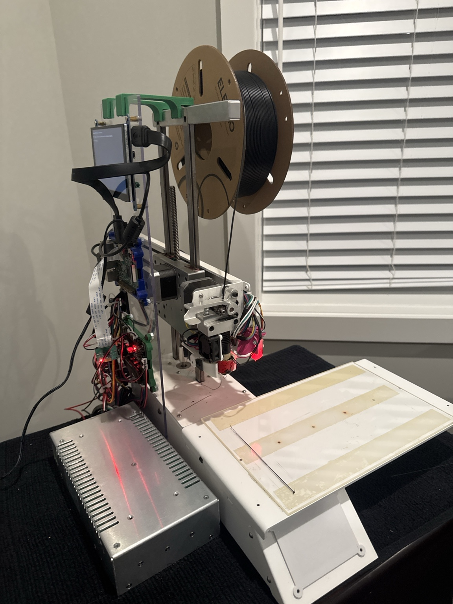

# Printrbot Simple Pro — Raspberry Pi + BTT SKR Pico + Klipper + BLTouch Conversion



## Overview

This project documents the modernization of a **Printrbot Simple Pro** by replacing the original control electronics with a **BigTreeTech SKR Pico** running **Klipper** and a **Raspberry Pi 3B+**.

The objective was to transform this legacy printer into a modern, reliable, and highly tunable machine while retaining the original mechanical platform.

This repository includes the hardware configuration, firmware, slicer profiles, printer configuration, tuning notes, and lessons learned throughout the conversion.

---

# Hardware

| Component | Description |
|-----------|-------------|
| Printer | Printrbot Simple Pro |
| Host | Raspberry Pi 3 Model B+ |
| Controller | BigTreeTech SKR Pico |
| Firmware | Klipper |
| Web Interface | Mainsail |
| API | Moonraker |
| Touchscreen | KlipperScreen |
| Bed Probe | BLTouch |
| Extruder | Stock Printrbot Extruder |
| Hotend | Stock Printrbot Hotend |
| Build Surface | Glass plate mounted with high-strength double-sided tape |
| Cooling | Stock fans (retuned) |

---

# SKR Pico Configuration

The following jumper configuration was found to provide reliable operation.

| Setting | Configuration |
|----------|---------------|
| BOOT Jumper | **Removed** |
| USB Power Jumper | **Removed** |
| USB Power Blocker | **Installed** |
| 12V Supply | **Connected** |

USB connection:

```
Raspberry Pi
      │
      ▼
USB Power Blocker
      │
      ▼
BTT SKR Pico
```

This configuration eliminates USB backfeeding while allowing the Pico to boot reliably from the printer's 12V supply.

---

# Software

- Klipper
- Moonraker
- Mainsail
- KlipperScreen
- OrcaSlicer 2.3.2

---

# Quick Start

## 1. Flash the SKR Pico

Compile Klipper for the following target:

```
Micro-controller Architecture: Raspberry Pi RP2040
Processor Model: RP2040
Bootloader Offset: No bootloader
Flash Chip: W25Q080 with CLKDIV 2
Communication Interface: USB (USBSERIAL)
```

Flash the generated `klipper.uf2` firmware.

---

## 2. Install MainsailOS

Install MainsailOS on a Raspberry Pi and complete the initial network setup.

---

## 3. Copy the Configuration

Copy:

```
printer.cfg
```

into:

```
~/printer_data/config/
```

---

## 4. Update the MCU Serial

Determine the USB device ID:

```bash
ls /dev/serial/by-id/
```

Update the `serial:` entry inside `printer.cfg`.

---

## 5. Restart Klipper

```bash
sudo systemctl restart klipper
```

---

## 6. Verify Motion

- Home all axes
- Verify endstops
- Verify BLTouch
- Verify heaters

---

## 7. Print a Calibration Model

Start with a calibration cube before printing Benchy or larger models.

---

# Current Status

✅ Fully operational

✅ Running Klipper

✅ Stable USB communication

✅ Reliable cold boots

✅ Dimensionally accurate prints

✅ Thermally stable

✅ Pressure Advance tuned

---

# Final Tuned Settings

## PLA

| Setting | Value |
|----------|-------|
| Nozzle | 0.30 mm |
| Layer Height | 0.20 mm |
| Temperature | 215–220°C |

---

## Klipper

| Setting | Value |
|----------|-------|
| Pressure Advance | ~0.11 |
| PID Tuning | Completed |

---

## Retraction

| Setting | Value |
|----------|-------|
| Distance | 0.8 mm |
| Speed | 35 mm/s |
| Wipe | Enabled |
| Z-hop | Disabled |

---

## Cooling

Fan speeds reduced to approximately **30–80%** to maintain hotend thermal stability while providing adequate part cooling.

---

## Print Speed

Approximately **80 mm/s** general print speed.

---

# Tuning Highlights

The following improvements were made during the conversion:

- Corrected extrusion scaling (`rotation_distance`)
- Calibrated PID for stable nozzle temperatures
- Eliminated heater shutdowns
- Resolved G2/G3 arc command compatibility
- Tuned Pressure Advance
- Optimized retraction
- Disabled unnecessary Z-hop
- Balanced cooling for improved surface finish
- Reduced stringing
- Improved dimensional accuracy

---

# Troubleshooting Notes

One particularly difficult issue involved intermittent USB enumeration of the SKR Pico.

The final solution consisted of:

- Removing the BOOT jumper after flashing
- Removing the USB power jumper
- Compiling Klipper firmware directly from the host Raspberry Pi
- Flashing the freshly compiled firmware
- Installing a USB power blocker
- Powering the Pico from the printer's 12V supply

This combination produced reliable cold boots and stable USB communication.

---

# Future Improvements

- Input Shaping
- Accelerometer tuning
- Complete wiring diagrams
- Printable electronics enclosure
- Cable management improvements
- Additional macros

---

# Repository Contents

- `printer.cfg`
- Wiring diagrams
- BLTouch configuration
- OrcaSlicer printer profile
- Macros
- Startup scripts
- Troubleshooting guide
- Photos of the conversion

---

# Notes

Although the electronics have been modernized, the project intentionally preserves the original Printrbot motion system. The goal is to demonstrate what can be achieved with modern firmware while retaining legacy hardware.

---

# Acknowledgements

Many thanks to the Klipper community, BigTreeTech, and the Printrbot community for providing documentation, examples, and inspiration that made this conversion possible.  The "Pro_Fan_Shroud.stl" file was the original from Printrbot. The "new_simple_production_v2_v81_fan_shroud_1_v1.stl" file was created by pmally - https://www.thingiverse.com/thing:3929880 - https://github.com/drphil3d

---

# Contributions

Contributions, suggestions, and improvements are always welcome.

If you're converting a Printrbot to Klipper, feel free to open an issue or submit a pull request.
